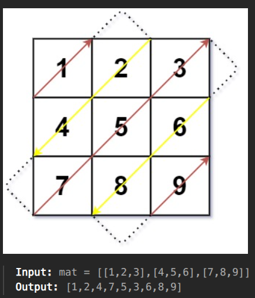

## 🧠 Solving LeetCode Until I Become Top 1% — Day `66`

### 🔹 Problem: [498. Diagonal Traverse](https://leetcode.com/problems/diagonal-traverse/description/?envType=daily-question&envId=2025-08-25)

**Difficulty:** #Medium
**Tags:** #Matrix

---

### 📝 Problem Summary

> Given an `m x n` matrix, return all elements of the matrix in a diagonal order as shown in the below image.
>
> 

---

### 🧠 My Thought Process

- **Brute Force Idea:**
  _This Problem is actually totally based on observation. And it's solution is also brute force. We just need to observe the pattern and implement it._

---

## Algorithm (Step-by-Step with Explanations):

1. **Initialize matrix dimensions**

   * Let `row = number of rows in matrix`.
   * Let `col = number of columns in matrix`.
   * This tells us the boundaries so we don’t step outside the matrix.

2. **Prepare storage for the result**

   * Create an empty list `res` to store elements in the required diagonal order.

3. **Track traversal direction (zig-zag)**

   * Use a flag `parity = True`.
   * This means:

     * `True` → traverse **up-right** (↗️).
     * `False` → traverse **down-left** (↙️).
   * We flip this after finishing each diagonal.

4. **Loop through diagonals**

   * There are exactly `row + col - 1` diagonals in total.
   * Each diagonal corresponds to elements where `r + c = s` (a fixed sum).
   * So we iterate `s` from `0` to `row + col - 2`.

5. **Case 1: Traverse upward-right (↗️) when parity is True**

   * Starting point:

     * Row index `r = min(s, row - 1)` (either bottom-most or current diagonal’s row).
     * Column index `c = s - r` (the complement so that `r + c = s`).
   * Keep moving:

     * While `r >= 0` and `c < col`:

       * Append `mat[r][c]` to result.
       * Move one step up-right: `r -= 1, c += 1`.

6. **Case 2: Traverse downward-left (↙️) when parity is False**

   * Starting point:

     * Column index `c = min(s, col - 1)` (either right-most or diagonal’s column).
     * Row index `r = s - c` (so that `r + c = s`).
   * Keep moving:

     * While `c >= 0` and `r < row`:

       * Append `mat[r][c]` to result.
       * Move one step down-left: `r += 1, c -= 1`.

7. **Flip direction**

   * After finishing one diagonal, set `parity = not parity` to switch between up-right and down-left.

8. **Return result**

   * After traversing all diagonals, return `res`.


---

### ⚙️ Code Implementation (Python)

```python
# Brief comment about the approach

class Solution:
    def findDiagonalOrder(self, mat: List[List[int]]) -> List[int]:
        row = len(mat)
        col = len(mat[0])
        parity = True

        res = []

        for s in range(row + col - 1):
            if parity:
                r = min(s, row - 1)
                c = s - r
                while r >= 0 and c < col:
                    res.append(mat[r][c])
                    r -= 1
                    c += 1
            else:
                c = min(s, col - 1)
                r = s - c
                while c >= 0 and r < row:
                    res.append(mat[r][c])
                    r += 1
                    c -= 1
            parity = not parity

        return res
```

---

### ⏱️ Time & Space Complexity

- **Time:** O(m * n) where m is number of rows and n is number of columns.
- **Space:** O(m * n) for the result list storing all elements.

---

### 🧩 Key Takeaways

- ✅ What concept or trick did I learn?
    - Observing patterns in matrix traversal and using a parity flag to alternate directions.
- 💡 What made this problem tricky?
    - Understanding how to calculate starting points for each diagonal based on the sum of indices.
- 💭 How will I recognize a similar problem in the future?
   - Look for problems involving matrix traversal with specific patterns or orders.

---

### 🔁 Reflection (Self-Check)

- [x] Could I solve this without help?
- [x] Did I write code from scratch?
- [x] Did I understand why it works?
- [x] Will I be able to recall this in a week?

---

### 📚 Related Problems

- [[2075 Decode the Slanted Ciphertext]]

---

### 🚀 Progress Tracker

| Metric                | Value        |
| --------------------- | ------------ |
| Day                   | `66`          |
| Total Problems Solved | `428`          |
| Confidence Today      | 😃|
| Leetcode Rating       | `1530`       |
