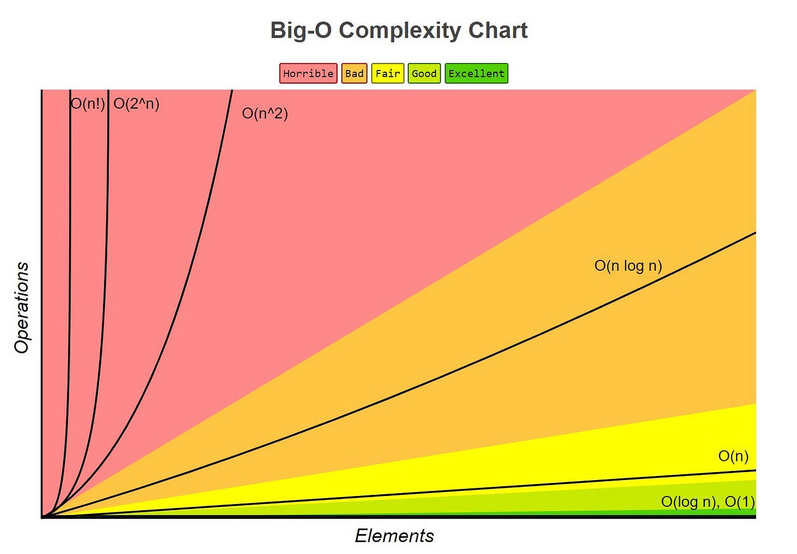

# Order Complexity Analysis

`Order complexity analysis` is method used to evaluate the `complexity` of algorithms or data structures based on their `order` of growth. This analysis helps in understanding how the performance of an algorithm scales with the size of the input.

Let's say we have an algorithm that has a time function `T(n)` where `n` is the size of the input.

For example, here is a simple code snippet that demonstrates the concept of order complexity:

```python
def example_algorithm(n):
    total = 0
    for i in range(n):
        for j in range(n):
            total += i * j
    return total
```

In this example, `T(n) = c + n^2`, where `c` is a constant. The order of growth is `O(n^2)`, which indicates that the time complexity of this algorithm increases quadratically with the size of the input.

Meaning, if the input size `n` doubles, the time taken by the algorithm will increase by a factor of four (since `2^2 = 4`).

Which is not good.

**How do we get the order of complexity?**

To determine the order of complexity, we analyze the algorithm's time function `T(n)` and identify the term that grows the fastest as `n` increases. We can ignore constant factors and lower-order terms since they become negligible for large `n`.

This is called `Big O notation`, which provides an upper bound on the growth rate of the function.

Here is a small plot to visualize the order of complexity:



**NEXT**: [[2_Experimental_Complexity_Analysis]]
